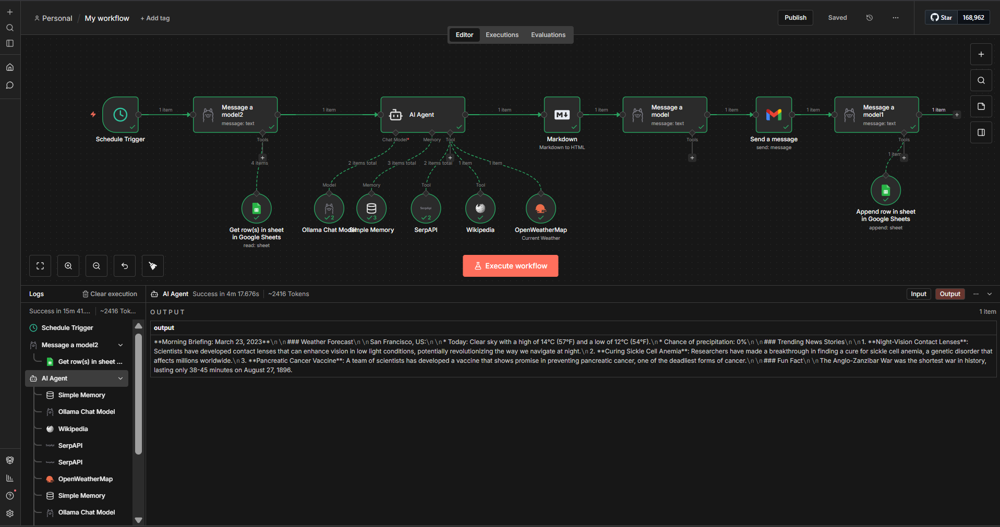
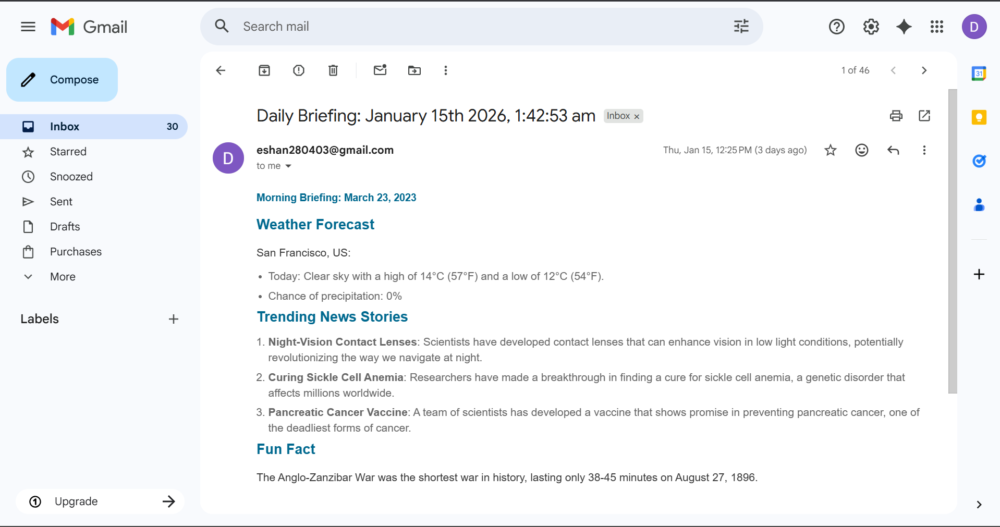
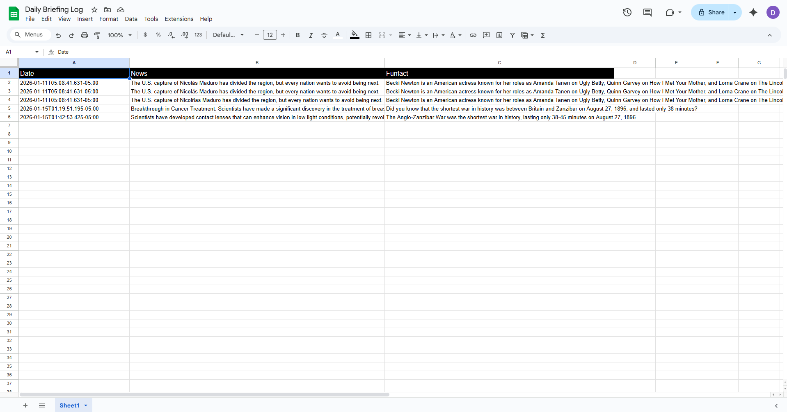

# ollama-ai-daily-briefing

# 📰 Ollama AI Daily Briefing (n8n Automation)

An end-to-end **AI-powered daily briefing automation** built using **Ollama (local LLM)** and **n8n**, delivering a curated morning newsletter with weather updates, positive news, and a fun fact — fully automated, emailed, and logged to Google Sheets.

> 🚀 Runs **100% locally for AI inference** — no OpenAI or cloud LLM dependency.

---

## 🚀 What This Project Does

Every morning, this system automatically:

- 🌤️ Collects the **current weather for San Francisco, US**
- 🗞️ Fetches **2–3 positive, trending news stories**
- 📚 Extracts a **fun fact from Wikipedia**
- 🧠 Uses memory to **avoid repeating content from previous days**
- ✉️ Formats the briefing as a **Markdown mini-newsletter**
- 📧 Sends the newsletter via **email**
- 📊 Logs structured data into **Google Sheets** for persistence and analysis

All orchestration is handled via **n8n**, with **Ollama running locally** for AI reasoning.

---

## 🖼️ Workflow Overview



---

## 📧 Email Preview



---

## 📊 Google Sheets Log




---

## ✨ Key Features

- 🔒 **Local AI inference** (privacy-friendly, no API costs)
- 🧠 **Persistent memory** to prevent duplicate news and facts
- 📬 **Email-ready Markdown formatting**
- 📊 **Structured logging** for future analytics or AI reuse
- 🔄 **Fully automated scheduling**
- ⚙️ **Modular, extensible workflow design**

---

## 📄 Example Output (Newsletter)

```md
## 🌅 Morning Briefing – March 23, 2026

### 🌤️ Weather Forecast (San Francisco)
- Clear skies
- High: 14°C (57°F)
- Low: 12°C (54°F)
- Precipitation: 0%

### 🗞️ Trending News Stories
1. Scientists develop night-vision contact lenses
2. Breakthrough in sickle-cell anemia treatment
3. Promising pancreatic cancer vaccine research

### 🎉 Fun Fact
The Anglo-Zanzibar War (1896) is the shortest war in history, lasting only 38–45 minutes.
